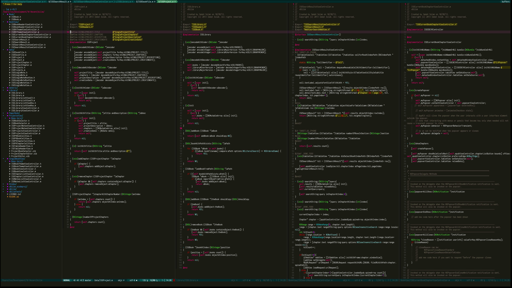
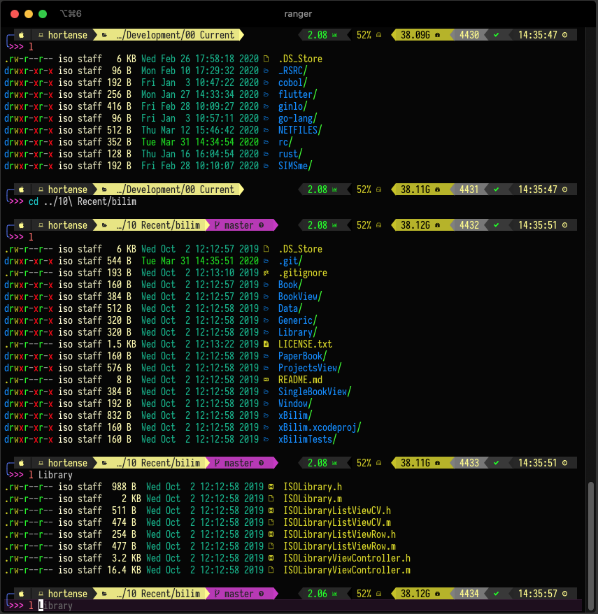

# My RC Files

These are my standard .rc-files used for `zsh` and `neovim` / `vim`.

I use `iTerm 2` on macOS.

Font is `Iosevka Nerd Font Mono`.

For `zsh` you need to install [Oh My Zsh](https://ohmyz.sh)

If you want to use `ranger` with `vim`, you need to install it using your favorite package manager.

## Screenshots

**neovim**

**zsh**

## Requirements

You should install

- msgpack
- neovim
- ripgrep (rg)
- lsd
- ag (silver-search)
- your favorite language parsers (dart, swift, rust, jslint,...)

## For vim & neovim

You need to install [vim-plug](https://github.com/junegunn/vim-plug), before you can install the plugins here. After installing `vim-plug`, start up your vim/neovim and enter `:PlugInstall`.

If all the pre-requisites were ok, you will have a nice vim/neovim-setup.

